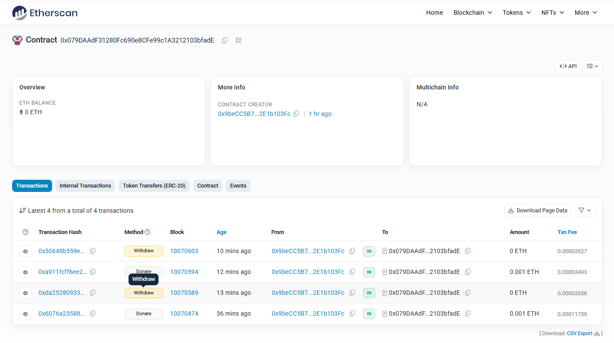

# Begging Contract - 智能合约项目

## 📋 项目简介
这是一个基于Solidity开发的智能合约项目，实现了简单的捐赠功能。合约允许用户向合约地址捐赠ETH，合约所有者可以提取捐赠资金。

## 🔗 合约信息
- **合约名称**: BeggingContract
- **网络**: Sepolia测试网
- **合约地址**: `0x079DAAdF31280Fc690e8CFe99c1A3212103bfadE`
- **Solidity版本**: 0.8.28
- **部署状态**: ✅ 已部署

## ✨ 功能特性
- ✅ 用户捐赠ETH功能
- ✅ 捐赠记录追踪
- ✅ 捐赠者列表管理
- ✅ 合约所有者资金提取
- ✅ 捐赠统计查询
- ✅ 事件日志记录

## 📝 合约方法

### 公共方法
- `donate()` - 向合约捐赠ETH
- `getDonation(address donor)` - 查询指定地址的捐赠金额
- `getContractBalance()` - 获取合约余额
- `getDonorCount()` - 获取捐赠者总数
- `owner()` - 获取合约所有者地址

### 仅所有者方法
- `withdraw()` - 提取合约资金

## 📸 测试截图

### 合约部署测试

*合约部署和功能测试截图*

## 🗂️ 项目结构

```
BeggingContract/ 
├── contracts/            # Solidity合约文件
│ ├── BeggingContract.sol # 主要合约
│ └── Counter.sol # 示例合约        
├── scripts/              # 部署脚本
│ ├── deploy.js           # 部署脚本示例
├── test/                 # 测试文件
├── ignition/             # 部署配置
│ ├── modules/            # 部署模块
│ └── deployments/        # 部署记录
├── images/               # 测试截图
└── README.md             # 项目说明
```


## 🚀 快速开始

### 环境要求
- Node.js 18+
- npm 或 yarn

### 安装依赖
```bash
npm install
```

### 编译合约
```bash
npx hardhat compile
```

### 运行测试
```bash
# 运行所有测试
npx hardhat test

# 运行Solidity测试
npx hardhat test solidity

# 运行Mocha测试
npx hardhat test mocha
```

### 部署合约
```bash
# 部署到本地网络
npx hardhat ignition deploy ignition/modules/BeggingContract.ts

# 部署到Sepolia测试网
npx hardhat ignition deploy --network sepolia ignition/modules/BeggingContract.ts
```

## 🛠️ 技术栈
- **Solidity**: 智能合约开发语言
- **Hardhat**: 以太坊开发框架
- **TypeScript**: 测试脚本语言
- **Sepolia**: 以太坊测试网络
- **Ethers.js**: Web3库
